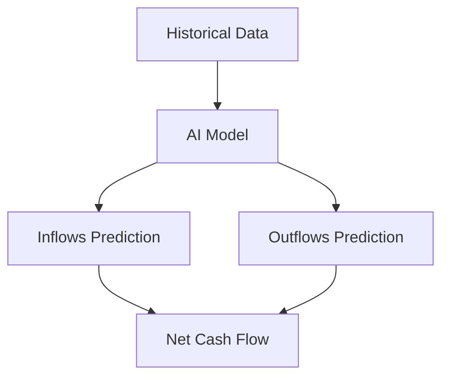

## Overview

Caleido empowers you to create dynamic cash forecasts that adapt to real-time business changes. You build forecasts using modular components, drill down to customer or supplier specifics, predict inflows and outflows accurately, and assess runway for strategic planning. These features help you spot risks early and make confident investment decisions.

<Columns cols={2}>
  <Card title="Smart Budgeting Blocks" icon="puzzle" href="#smart-budgeting-blocks">
    Assemble flexible budgets with reusable blocks for expenses, revenue, and more.
  </Card>
  <Card title="Customer & Supplier Forecasting" icon="users" href="#customer-supplier">
    Forecast at granular levels for precise cash flow predictions.
  </Card>
  <Card title="Inflows & Outflows Prediction" icon="trending-up" href="#inflows-outflows">
    Model cash movements with AI-driven accuracy.
  </Card>
  <Card title="Runway & Investment Planning" icon="activity" href="#runway-planning">
    Calculate burn rates and simulate funding scenarios.
  </Card>
</Columns>

## Smart Budgeting Blocks

Smart budgeting blocks let you construct forecasts like building blocks. You define reusable components for fixed costs, variable expenses, or revenue streams, then combine them into scenarios.

<Steps>
  <Step title="Create a Block" icon="plus">
    Navigate to the Blocks dashboard in Caleido.
    
    Click "New Block" and select type (e.g., `expense`).
  </Step>
  <Step title="Configure Parameters" icon="settings">
    Set inputs like monthly rate or growth factor.
    
````json
{
  "name": "Marketing Budget",
  "type": "expense",
  "monthly": 5000,
  "growth": 0.05
}
````
  </Step>
  <Step title="Add to Forecast" icon="plus-circle">
    Drag the block into your forecast canvas.
  </Step>
</Steps>

<Callout kind="tip">
  Reuse blocks across multiple forecasts to maintain consistency.
</Callout>

## Customer and Supplier Level Forecasting

Break down forecasts by individual customers or suppliers for higher accuracy. This granularity reveals concentration risks and payment trends.

<Tabs>
  <Tab title="Customers" icon="user">
    Track receivables by client.
    
    ```javascript
    const customerForecast = await fetch('https://api.example.com/v1/forecast/customers/123', {
      headers: { Authorization: `Bearer ${YOUR_TOKEN}` }
    });
    ```
  </Tab>
  <Tab title="Suppliers" icon="truck">
    Predict payables based on vendor history.
    
    ```python
    import requests
    response = requests.get(
      'https://api.example.com/v1/forecast/suppliers/456',
      headers={'Authorization': f'Bearer {YOUR_TOKEN}'}
    )
    ```
  </Tab>
</Tabs>

## Predicting Cash Inflows and Outflows

Caleido uses historical data and trends to predict inflows from sales and outflows from operations. You adjust assumptions for what-if scenarios.



<CodeGroup tabs="JavaScript,Python">
```javascript
// Predict inflows
const inflows = await caleido.predictInflows({
  period: 'Q4 2024',
  customers: ['acme-corp', 'beta-inc']
});
```
```python
# Predict outflows
outflows = caleido.predict_outflows(
    period='Q4 2024',
    suppliers=['vendor-x', 'vendor-y']
)
```
</CodeGroup>

## Assessing Runway and Investment Planning

Evaluate your cash runway and test investment scenarios. Caleido computes months of runway based on burn rate and simulates funding rounds.

<Expandable title="Advanced Runway Calculation" default-open="false">
  Use these parameters for custom simulations:
  
  <ParamField path="burn_rate" param-type="number" required="true">
    Monthly cash burn in USD.
  </ParamField>
  
  <ParamField path="funding_amount" param-type="number">
    Proposed investment size.
  </ParamField>
</Expandable>

<Callout kind="success">
  Integrate with your dashboard at `https://dashboard.example.com` for real-time updates.
</Callout>

<Columns cols={3}>
  <Card title="Quickstart" icon="rocket" href="/quickstart">
    Get started in minutes.
  </Card>
  <Card title="Authentication" icon="lock" href="/authentication">
    Secure your API access.
  </Card>
  <Card title="API Reference" icon="code" href="/api-reference">
    Full endpoint details.
  </Card>
</Columns>